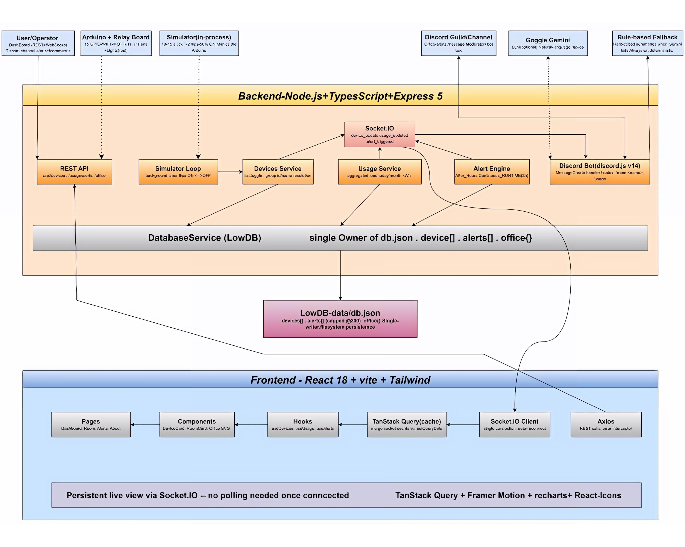
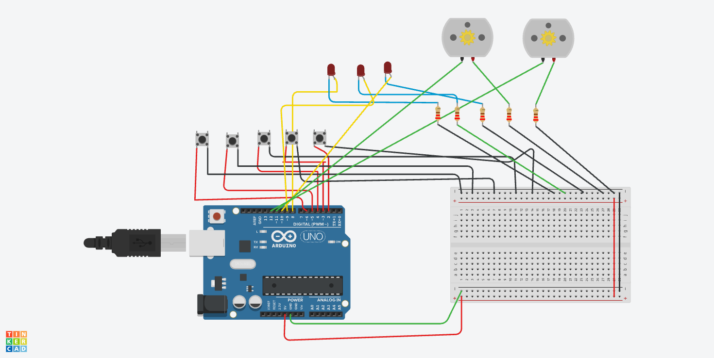

# 🏢 SUST LifeLink — Office IoT Monitoring System

A real-time monitoring and alert system for fans and lights in a small three-room office. The system tracks the live state of every device, measures today's energy use, sends an immediate alert on Discord when devices are left on after hours or running too long, and ships with a top-down SVG floor plan that matches the room layout.

> 🏆 Built for **Hackathon TECHATHON NATIONALS 2026 (Preliminary Round)**
> 🧪 Team name: **SUST LifeLink**

---

## Table of contents

1. [Project setup and running guide](#project-setup-and-running-guide) 
2. [System design](#system-design)
3. [Circuit design](#circuit-design)
4. [Backend and frontend implementation](#backend-and-frontend-implementation)
5. [Team](#team)

---

# Project setup and running guide

This section is written for someone who has **never seen the project before**. Follow the steps in order. By the end you will have the backend, the dashboard, and the Discord bot running side by side.

## 1. Prerequisites

Install these **before** you start. Versions are the ones used by the team during development.

| Tool | Required version | Purpose |
| --- | --- | --- |
| **Node.js** | `20.x` or newer (LTS recommended) | Runs both the backend and the front-end dev server |
| **npm** | `10.x` or newer | Comes bundled with Node.js — installs dependencies |
| **Git** | any recent version | Cloning the repository |
| **A modern browser** | Chrome, Edge, or Firefox | Opens the dashboard at `http://localhost:5173` |

Optional (only needed if you run the Discord bot):

| Tool | Purpose |
| --- | --- |
| A Discord server you control | To invite the bot and receive alerts |
| A Discord bot token | From the [Discord Developer Portal](https://discord.com/developers/applications) |
| A Google Gemini API key | Free-text Q&A in the Discord bot (the bot works without it and falls back to rule-based answers) |

## 2. Clone the repository

```bash
git clone https://github.com/Rahad0Islam/IOT_PRELI.git
cd IOT_PRELI
```

You will see three folders at the root:

```
back-end/      Node.js + TypeScript REST API + Socket.IO + Discord bot
front-end/     React + Vite + Tailwind dashboard
docs/          system design + circuit diagrams
```

## 3. Database setup

There is **no manual database step**. The back-end uses [LowDB](https://github.com/typicode/lowdb), a tiny JSON file store. The first time the server starts it creates two files automatically:

- `back-end/src/database/db.json` — list of devices, alerts, and history.
- `back-end/src/database/runtime-history.json` — per-device runtime counters.

Both files are seeded with a default office (three rooms, 5 devices each) on the very first run. To reset the office to its original state, stop the backend and delete those two files — they will be recreated on the next start.

## 4. Backend setup

### 4.1 Install Node.js

Download from [nodejs.org](https://nodejs.org/) and verify:

```bash
node --version    # should print v20.x or newer
npm --version
```

### 4.2 Install backend dependencies

```bash
cd back-end
npm install
```

This installs Express 5, Socket.IO 4, LowDB, Discord.js, the Google Generative AI SDK, TypeScript, tsx, and a small number of helpers.

### 4.3 Configure environment variables

```bash
cp .env.example .env
```

Open `back-end/.env` in any text editor. Every variable has a working default — the server starts with an empty file. You only need to set values for the features you want to turn on:

| Variable | What to set | When |
| --- | --- | --- |
| `DISCORD_TOKEN` | Bot token from the Discord developer portal | Only if you want the Discord bot |
| `DISCORD_ALERT_CHANNEL_ID` | A channel ID the bot can post in | Only if you want alerts delivered to Discord |
| `DISCORD_GUILD_IDS` | Comma-separated guild IDs the bot should join | Only if you want slash-command-style guild joining |
| `GEMINI_API_KEY` | A Google Gemini API key | Only if you want free-text AI answers in the bot. Empty = rules-only fallback |
| `CORS_ORIGINS` | Set to `http://localhost:5173` if you change the front-end port | Only if you customize the front-end URL |

A safe minimal `.env` while testing locally is just:

```env
PORT=4000
CORS_ORIGINS=*
SIMULATOR_ENABLED=true
```

### 4.4 Run the backend in development

```bash
npm run dev
```

Expected terminal output (last lines):

```
[info] socket.io attached
[info] simulator started intervalMs=12000
[info] office-iot-backend listening on :4000
```

The backend is now running at **`http://localhost:4000`**. It exposes both REST endpoints and the Socket.IO channel.

### 4.5 Sanity check the backend

Open a second terminal and run:

```bash
curl http://localhost:4000/api/devices
```

You should get JSON with 15 devices. If you see JSON, the backend is healthy.

### 4.6 Optional backend scripts

```bash
npm run typecheck         # TypeScript only — no server start
npm run verify:alerts     # Self-test across alert engine, runtime, and front-end types
npm run build && npm start # Compile to dist/ and run the production bundle
```

## 5. Dashboard (front-end) setup

Open a **new terminal** — keep the backend terminal running.

### 5.1 Install front-end dependencies

```bash
cd front-end
npm install
```

This installs React 18, Vite 5, Tailwind, TanStack Query, Recharts, Framer Motion, react-icons, and the Socket.IO client.

### 5.2 Configure environment variables

```bash
cp .env.example .env
```

Default values already point at `http://localhost:4000`. Only change them if you moved the backend to a different port or host.

### 5.3 Run the dashboard in development

```bash
npm run dev
```

Expected terminal output:

```
VITE v5.4.x  ready in xxx ms
➜  Local:   http://localhost:5173/
```

Open **`http://localhost:5173`** in your browser. You should see the dashboard with summary cards, a power gauge, an SVG floor plan, and room cards.

### 5.4 Optional front-end scripts

```bash
npm run typecheck     # TypeScript only
npm run build         # Production bundle into front-end/dist
npm run preview       # Serve the production bundle locally
```

## 6. Discord bot setup

> Skip this section if you do not want a Discord bot. The REST API, dashboard, and simulator all work without it.

### 6.1 Create a Discord application

1. Go to the [Discord Developer Portal](https://discord.com/developers/applications).
2. Click **New Application** → name it (e.g. `SUST LifeLink Bot`).
3. Open the **Bot** tab → click **Add Bot** → copy the token.
4. Under **Privileged Gateway Intents**, enable **Message Content Intent** (the bot reads message text for `!commands`).
5. Under **OAuth2 → URL Generator**, tick `bot` and `Send Messages`, then open the generated URL to invite the bot to your server.

### 6.2 Get the channel ID

In Discord, right-click any channel → **Copy Channel ID**. You need Developer Mode enabled in Settings → Advanced for this option to appear.

### 6.3 Add credentials to `back-end/.env`

```env
DISCORD_TOKEN=<paste your bot token>
DISCORD_ALERT_CHANNEL_ID=<paste channel id>
DISCORD_GUILD_IDS=<your server id>
```

Restart the backend:

```bash
# Ctrl+C in the backend terminal, then:
npm run dev
```

Look for the line:

```
[info] discord bot logged in as YourBot#1234
```

The bot is now online and will post every new alert to the configured channel.

### 6.4 Optional: enable Gemini (AI answers)

```env
GEMINI_API_KEY=<paste your Google Gemini API key>
```

Free-text questions like *“how many lights are still on?”* will be forwarded to Gemini with the live office state attached. Without a key the bot answers from a small rule-based set.

### 6.5 Try the bot

In any channel the bot can read, type:

```
!help
!status
!devices
!usage
!alerts
```

## 7. Running the complete system

Open **three terminals** (or three tabs of your terminal). Then run:

```bash
# Terminal 1 — backend
cd back-end  && npm run dev

# Terminal 2 — dashboard
cd front-end && npm run dev

# Terminal 3 — optional quick check
curl http://localhost:4000/api/devices
```

In the browser open **`http://localhost:5173`**. With `SIMULATOR_ENABLED=true`, devices will start flipping every ~12 seconds — the dashboard updates without any manual refresh thanks to Socket.IO.

## 8. Troubleshooting

| Symptom | Likely cause | Fix |
| --- | --- | --- |
| `EADDRINUSE :::4000` on backend start | Another process is using port 4000 | Change `PORT=4001` in `back-end/.env` and update `VITE_API_BASE` / `VITE_SOCKET_URL` in `front-end/.env` to match |
| Browser shows CORS error | `CORS_ORIGINS` doesn't include the front-end origin | Set `CORS_ORIGINS=http://localhost:5173` in `back-end/.env` |
| Dashboard loads but devices never change | Backend not running | Confirm `curl http://localhost:4000/api/devices` returns JSON |
| Socket never connects | Wrong `VITE_SOCKET_URL` | Check `front-end/.env` matches the backend host and port |
| Discord bot does not log in | Missing or wrong token | Regenerate the token in the Discord developer portal, update `DISCORD_TOKEN`, restart the backend |
| Discord bot logged in but no alerts | Wrong channel ID or missing permission | Re-invite the bot with `Send Messages` permission; double-check `DISCORD_ALERT_CHANNEL_ID` |
| `npm install` fails on Apple Silicon | Old Node or missing build tools | Use Node 20+, on macOS run `xcode-select --install` if requested |
| Devices look "stuck ON" after a backend restart | Runtime is persisted every 30 seconds, so up to 30 s of ON time can be lost on a hard crash | By design — see [Runtime tracking](#runtime-tracking) below |

---

# System design



The diagram above shows every layer of the system and how data flows between them.

## Component overview

| Component | Technology | What it does |
| --- | --- | --- |
| **IoT devices** | Arduino + relay module (simulated in software by the built-in simulator) | 5 devices per room — 2 fans, 3 lights. The hardware toggles relays and pushes state to the backend |
| **Backend API** | Node.js + Express 5 | Single REST + WebSocket server that owns the device state, aggregates usage, runs the alert engine, and hosts the Discord bot |
| **Database** | LowDB JSON files (`db.json`, `runtime-history.json`) | Source of truth for devices, alerts, and runtime totals |
| **Real-time channel** | Socket.IO 4 attached to the same HTTP server | Pushes `device_updated`, `usage_updated`, `runtime_updated`, and `alert_triggered` events to all connected dashboards |
| **Frontend dashboard** | React 18 + Vite 5 + Tailwind + TanStack Query + Recharts | Live office floor plan, power gauge, room cards, charts, alerts panel |
| **Discord bot** | Discord.js 14 + Google Gemini | Receives alert push-outs and answers `!commands` posted in any channel it can read |
| **External services** | Google Gemini API (optional) | Adds free-text Q&A to the bot. Has a rule-based fallback when no API key is provided |

## Data flow

1. **Device toggle** — A button (Tinkercad Arduino, see [Circuit design](#circuit-design)) toggles a relay. The Arduino sends `POST /api/devices/toggle` with `{ "id": "<uuid>", "status": "ON" }`. The built-in simulator does exactly the same thing when hardware is not connected.
2. **Backend writes** — The toggle endpoint validates the body with `express-validator`, calls the device service, which updates the device in LowDB (`db.json`).
3. **Backend broadcasts** — The device service calls `socketService.emit('device_updated', updated)`. Every connected browser receives the event within milliseconds.
4. **Runtime tick** — A timer wakes every `RUNTIME_TICK_INTERVAL_MS` (default 30 s). It accrues ON time per device, flushes the totals to `runtime-history.json` every `RUNTIME_PERSIST_INTERVAL_MS`, and emits `runtime_updated`.
5. **Usage aggregation** — A handler reads the latest devices and runtime, computes total watts per room and today's kWh per room, and emits `usage_updated`.
6. **Alert scan** — A separate timer wakes every `ALERT_SCAN_INTERVAL_MS` (default 60 s). For each rule (after-hours, continuous-runtime) it checks every device. Each new alert is persisted, broadcast via `alert_triggered`, and posted to the Discord channel.
7. **Dashboard render** — On page load the dashboard pulls `GET /api/usage`. After that it only listens; React Query is invalidated on each socket event so every card stays in sync without manual refresh.
8. **Discord bot reply** — When a `!command` arrives in any reachable channel, the bot checks a rules table first, then optionally forwards to Gemini with live office context. Gemini replies are stitched into a single Discord message.

---

# Circuit design



This circuit was designed in **Tinkercad** and simulated in **Tinkercad Arduino**. The diagram represents **one room** of the office (e.g. the Drawing Room), containing **2 fans and 3 lights**. The same diagram repeats for Work Room 1 and Work Room 2 in the full deployment.

## How the circuit is laid out

- The **Arduino** sits in the middle of the breadboard. It receives 5 V on `5V` and ground on `GND`.
- Each **light bulb** is driven by a relay module. The relay coil is energized through one digital pin (D2–D4) and a flyback diode across the coil.
- Each **fan motor** is driven by its own relay on a digital pin (D5–D6), also with a flyback diode.
- A **push button** is wired between the assigned button pin and ground. The internal pull-up resistor is enabled in software so the pin reads `HIGH` when not pressed and `LOW` when pressed.
- The Arduino loop polls every button. When a button transitions from `HIGH` to `LOW`, it toggles the matching device and sends `POST /api/devices/toggle` to the backend with the device's UUID and `status`.

## Pin mapping

The pin assignments used in the Tinkercad simulation and in the back-end seed match exactly:

| Device  | Arduino Pin | Button Pin |
| ------- | ----------- | ---------- |
| Light 1 | D2          | D8         |
| Light 2 | D3          | D9         |
| Light 3 | D4          | D10        |
| Fan 1   | D5          | D11        |
| Fan 2   | D6          | D12        |

Each device in `back-end/src/database/db.json` has the same UUID regardless of which Arduino room it lives in, so the backend can drive any hardware setup that POSTs the right UUID.

## How commands travel through the system

1. The user **presses a button** on the Arduino. The matching digital pin reads `LOW` (because the internal pull-up is enabled and the button grounds the line).
2. The Arduino's `loop()` detects the falling edge, calls `toggleDevice(pin)`, and flips the matching relay pin (`HIGH` or `LOW`).
3. The Arduino then sends an HTTP request to the backend:
   ```json
   { "id": "<device UUID>", "status": "ON" }
   ```
4. The backend validates the request, updates `db.json`, and emits `device_updated` on Socket.IO.
5. Every dashboard in the world sees the toggle within a few hundred milliseconds. The floor-plan icon for that device lights up, the power gauge steps, and the room card updates.
6. If the device stays ON for more than `DEVICE_RUNTIME_ALERT_MINUTES` (default 120), the alert engine fires and the Discord bot posts a **CONTINUOUS_RUNTIME** alert.

If Arduino hardware is not available during demo, the same path is exercised by the built-in simulator (`back-end/src/modules/simulator/`). It flips 1–2 random devices every `SIMULATOR_INTERVAL_MS` (default 12 s) by calling the exact same internal service function.

---

# Backend and frontend implementation

This section explains **the code as it actually is**, not a generic textbook description.

## Backend

### Stack

- **Runtime:** Node.js 20+ with ES modules (`"type": "module"`).
- **Language:** TypeScript (`strict`, `noUncheckedIndexedAccess`).
- **HTTP:** Express 5 with `express-validator`.
- **Real-time:** Socket.IO 4 attached to the same HTTP server.
- **Persistence:** LowDB 7 with a JSON file.
- **Discord:** `discord.js` v14.
- **LLM:** `@google/generative-ai` (optional).
- **Dev:** `tsx` for hot reload, `tsc` for type checking and the production build.

### Project structure

```
back-end/src/
├── app.ts                        Express factory (no listen)
├── server.ts                     Process entry point + graceful shutdown
├── config/config.ts              env → typed config (single source of truth)
├── database/
│   ├── database.service.ts       LowDB wrapper (only module that touches db.json)
│   └── db.json                   runtime data file (auto-created)
├── socket/socket.service.ts      Socket.IO singleton
├── middleware/                   404, error, async wrapper, request logger
├── modules/
│   ├── devices/                  list / toggle / group-by-room
│   ├── usage/                    aggregated load + today's kWh
│   ├── runtime/                  persistent per-device runtime engine
│   ├── alerts/                   engine + scheduler + REST routes
│   ├── office/                   office-hours config + setter
│   ├── simulator/                background toggle timer
│   └── discord/                  bot + Gemini + rule-based fallback
├── types/enums.ts                Device, Room, Alert, SocketEvent, ROOM_LABELS
├── interfaces/                   TypeScript shapes for DB records
└── utils/                        logger, time helpers, db seed
```

### API architecture

The app is a single Express app with one router per module, mounted under `/api/`:

| Mount | Module | Purpose |
| --- | --- | --- |
| `/api/devices` | `devices` | Listing, filtering, toggling |
| `/api/usage` | `usage` | Aggregated snapshot |
| `/api/runtime` | `runtime` | Per-device runtime + history file info |
| `/api/alerts` | `alerts` | Active alerts list + clear-all |
| `/api/office` | `office` | Read/update office hours |

Every response follows `{ "success": true, "data": ... }` on success and `{ "success": false, "error": "..." }` on failure. Handlers are wrapped with `asyncHandler` so uncaught errors land in the central error middleware and return a clean 5xx JSON.

### Request flow (example: toggle a device)

1. The browser (or Arduino, or simulator) sends `POST /api/devices/toggle`.
2. `device.routes.ts` runs `express-validator` rules (UUID format, status enum).
3. `device.controller.ts` calls `device.service.toggle(id, status)`.
4. `device.service` reads the current state, flips it, writes back to LowDB, updates `lastChanged`, emits `device_updated` and `usage_updated`, and returns the new device.
5. The controller returns the JSON response.

### Database interactions

Only `database/database.service.ts` reads or writes the JSON file. Every other module calls `databaseService.read()` / `databaseService.write()` (or higher-level helpers). Runtime totals are a special case — they are kept in memory by the runtime service and flushed to `runtime-history.json` on a timer, so toggles never block on disk I/O.

### Real-time communication

- `socket/socket.service.ts` lazily creates one `io` server attached to the same HTTP server.
- Modules call `socketService.emit(SocketEvent.X, payload)`.
- The full set of events: `device_updated`, `usage_updated`, `runtime_updated`, `alert_triggered`. The enum lives in `types/enums.ts`.
- The front-end subscribes through `SocketContext`, which joins the default room.

### Discord bot integration

- `modules/discord/discord.service.ts` boots a `discord.js` client on `init()`.
- It listens for `MessageCreate`. Anything starting with `!` is treated as a command.
- Commands are dispatched in a switch: `!help`, `!status`, `!devices`, `!usage`, `!alerts`, `!room <id>`.
- Free-text questions are forwarded to `gemini.service.ts`. If no Gemini key is set, that service falls back to a small rule table.
- Every new alert (from `alert.service.ts`) is sent as a colour-coded embed to `DISCORD_ALERT_CHANNEL_ID`.
- The whole bot is opt-in: with no `DISCORD_TOKEN` it simply never logs in.

### Hardware communication

Hardware does not speak Socket.IO — it speaks HTTP. The Arduino loop hits `POST /api/devices/toggle`. That endpoint is the single ingress for *any* source of truth, which is why the simulator calls the exact same internal service function. The Discord bot never talks to the Arduino directly; it only reads state from the database through the alert and usage services.

### Main business logic

| Concern | Location | How it works |
| --- | --- | --- |
| Device state | `modules/devices/device.service.ts` | Reads, writes, toggles, then emits the matching socket events |
| Runtime tracking | `modules/runtime/runtime.service.ts` | Keeps `todayRuntimeSeconds` and `totalRuntimeSeconds` per device in memory; a timer adds ON time; another timer flushes to disk |
| Daily reset | `modules/runtime/runtime-history.service.ts` | Once per local day the service archives yesterday's totals, resets today counters, and writes `lastDailyReset` |
| Usage aggregation | `modules/usage/usage.service.ts` | Computes `totalPowerWatts`, `rooms[].powerWatts`, `estimatedTodayKWh`, `rooms[].todayKWh`, plus the chart history |
| Alert engine | `modules/alerts/alert.service.ts` | Two rules: `AFTER_HOURS` (device ON outside office hours) and `CONTINUOUS_RUNTIME` (device ON longer than `DEVICE_RUNTIME_ALERT_MINUTES`) |
| Alert scheduling | `modules/alerts/alert.scheduler.ts` | A `setInterval` runs the engine every `ALERT_SCAN_INTERVAL_MS` |
| Simulator | `modules/simulator/simulator.service.ts` | A `setInterval` flips 1–2 random devices every `SIMULATOR_INTERVAL_MS` by calling the same internal toggle function |

### Error handling

- Every async route handler is wrapped with `middleware/asyncHandler.ts`.
- `middleware/errorHandler.ts` is the terminal handler — it logs the error, hides the stack in production, and always returns a JSON `{ success: false, error: ... }`.
- `middleware/notFoundHandler.ts` covers unmatched routes.
- Modules never throw raw — they throw typed errors and let the central handler format them.

## Frontend

### Stack

- **Runtime:** Vite 5 dev server, React 18.
- **Language:** TypeScript (`strict`, `noUncheckedIndexedAccess`).
- **Styling:** Tailwind 3 with a small dark "ink" palette.
- **Data:** TanStack Query 5 for REST + cache, Socket.IO client for live updates.
- **Charts:** Recharts for the power-history and per-room pie charts.
- **Motion:** Framer Motion for the card micro-animations.
- **Icons:** `react-icons` (`FaTable`, `FaChair`, plus the project-internal `FanIcon` and `LightBulbIcon`).

### Project structure

```
front-end/src/
├── main.tsx                          React + Socket context + React Query provider
├── App.tsx                           Routes
├── layouts/DashboardLayout.tsx       Sidebar + topbar shell
├── pages/
│   ├── DashboardPage.tsx             Live overview (default route "/")
│   ├── RoomPage.tsx                  /rooms/:room — one room, focused
│   ├── AlertsPage.tsx                /alerts — active alerts list
│   └── AboutPage.tsx                 /about — project metadata
├── components/
│   ├── SummaryCards.tsx              Live Power · Today (kWh) · Active/Alerts
│   ├── PowerMeter.tsx                SVG gauge + Today/Cap Stat row
│   ├── OfficeLayout.tsx              Top-down SVG floor plan with chairs, tables, fans, bulbs
│   ├── AlertsPanel.tsx               Latest alerts with severity colour
│   ├── PowerHistoryChart.tsx         Recharts line chart of watts over time
│   ├── RoomUsagePieChart.tsx         Recharts pie of kWh share per room
│   ├── RoomCard.tsx                  One card per room (used on the dashboard and on the room page)
│   ├── DeviceCard.tsx                Single device card used inside a RoomCard
│   ├── FanIcon.tsx                   Animated rotating fan SVG (used in OfficeLayout)
│   ├── LightBulbIcon.tsx             Glowing bulb SVG (used in OfficeLayout)
│   ├── AnimatedNumber.tsx            Tweened number used in cards
│   ├── ConnectionStatus.tsx          Tiny indicator (green/red) for the socket
│   ├── ErrorBoundary.tsx             Top-level crash boundary
│   ├── Footer.tsx                    Footer with team name
│   └── Navbar.tsx                    Top bar
├── hooks/
│   ├── useDevices.ts                 Fetches all devices and exposes the cache
│   ├── useUsage.ts                   Fetches the aggregated snapshot and wires the socket
│   ├── useAlerts.ts                  Fetches alerts and wires the socket
│   └── useToggleDevice.ts            Mutation hook for toggling
├── contexts/SocketContext.tsx        Single Socket.IO connection, exposed via React context
├── api/
│   ├── http.ts                       Axios instance pointing at VITE_API_BASE
│   ├── device.api.ts
│   ├── usage.api.ts
│   └── alert.api.ts
├── types/domain.ts                   Mirror of `back-end/src/types/enums.ts`
└── utils/config.ts                   Reads VITE_API_BASE, VITE_SOCKET_URL
```

### Routing

`App.tsx` mounts a single `DashboardLayout` and four nested routes inside it, plus a catch-all redirect to `/`.

| Path | Page |
| --- | --- |
| `/` (`index`) | `DashboardPage` |
| `/rooms/:room` | `RoomPage` (filtered to `drawing`, `work1`, or `work2`) |
| `/alerts` | `AlertsPage` |
| `/about` | `AboutPage` |
| `*` | `Navigate to="/" replace` |

### State management

- **Server state** lives in TanStack Query. Each resource has its own `useQuery` hook so cache invalidation is local. The socket layer calls `queryClient.invalidateQueries(['usage'])` etc. on each relevant event, so React re-renders without manual refetch logic in components.
- **Live state** lives in `SocketContext`. There is exactly one connection per app session; on disconnect it shows the red status dot, on reconnect it shows green and re-invalidates the queries.
- **Local UI state** lives in each component with `useState` / `useReducer`. There is no Redux because the surface area is small.

### API communication

`api/http.ts` configures an Axios instance with `baseURL = import.meta.env.VITE_API_BASE` and a single response interceptor that unwraps `{ success, data }` envelopes and surfaces `error` cleanly to React Query.

### Authentication flow

The project does **not** have user authentication in this iteration — the office size and threat model do not require it. Adding it later means mounting an auth middleware in `back-end/src/middleware/` and gating `api/*` routes, then adding an `AuthContext` plus a login screen in the front-end. The `DashboardLayout` already has a slot where this could live.

### Dashboard logic

`DashboardPage.tsx` is the main screen. It:

1. Renders `SummaryCards` (live power, today kWh, active alerts) at the top.
2. Renders a 3-column grid: `PowerMeter` (spans 2) and `AlertsPanel`.
3. Renders `OfficeLayout` — the SVG floor plan with chairs, tables, fans, bulbs.
4. Renders a 2-column row of charts: `PowerHistoryChart` and `RoomUsagePieChart`.
5. Renders a per-room `RoomCard` grid below the charts.

Every child subscribes (directly or via a hook) to the same `SocketContext`, so any change anywhere on the page pushes updates everywhere else.

### Device control flow

1. The user clicks a `DeviceCard` toggle.
2. `useToggleDevice` calls `POST /api/devices/toggle` via React Query's `useMutation`.
3. On success, `queryClient.invalidateQueries(['devices'])` and `queryClient.invalidateQueries(['usage'])`.
4. Independently, the backend has already emitted `device_updated` and `usage_updated`, so even other tabs see the change immediately.

### Real-time updates

`SocketContext` opens one connection on app mount, joins the default room, and registers handlers for `device_updated`, `usage_updated`, `runtime_updated`, and `alert_triggered`. Each handler is one line:

```ts
socket.on('usage_updated', () => queryClient.invalidateQueries(['usage']));
```

The connection status is exposed via `ConnectionStatus` (a green/red dot in the navbar).

### UI component responsibilities

| Component | What it shows |
| --- | --- |
| `SummaryCards` | Three hero stats: live watts, today's kWh, active alerts count |
| `PowerMeter` | SVG gauge (current watts vs 1500 W cap) and a row with today's kWh and the cap |
| `OfficeLayout` | SVG floor plan: three rooms, two tables in larger rooms, chairs around each table, fans on top of each room, bulbs on the bottom |
| `AlertsPanel` | Latest few alerts with severity colour and a link to the alerts page |
| `PowerHistoryChart` | Recharts line chart of total office watts over the last hour |
| `RoomUsagePieChart` | Recharts pie of today's kWh share per room |
| `RoomCard` | Per-room grid of devices with status pill + power draw |
| `DeviceCard` | Single device row used inside a `RoomCard`; click to toggle |

### Important pages

- **DashboardPage** (`/`): the default view, described above.
- **RoomPage** (`/rooms/:room`): one room, larger cards, focus mode.
- **AlertsPage** (`/alerts`): every active alert in a long list, severity-coloured.
- **AboutPage** (`/about`): project metadata — competition name, team, technologies used.

### Overall application workflow

1. User lands on `/`. React mounts, `DashboardLayout` sets up the shell, then `DashboardPage` runs.
2. `useDevices`, `useUsage`, `useAlerts` fetch the initial snapshot over REST. Socket connects.
3. The user sees live data. Clicking a device triggers a mutation; the server responds; the socket pushes the same update back to all clients; TanStack Query invalidates the affected cache entries; React re-renders.
4. When the alert engine fires, the user sees a banner immediately, and (if configured) the Discord bot posts the same alert.
5. The dashboard can run for hours without a single manual refresh.

---

# Team

Competition: **Hackathon TECHATHON NATIONALS 2026 (Preliminary Round)**

Team name: **SUST LifeLink**

Team members:

| Name | Role |
| --- | --- |
| **Autanu Datta** | Team Leader |
| **Rahad Islam** | Backend & Frontend engineering |
| **Iftakharul Alam Tarit** | Frontend & UI |
| **Taposh Ghosh** | Hardware (Tinkercad circuit) & documentation |

Thank you for reviewing our work. 🚀